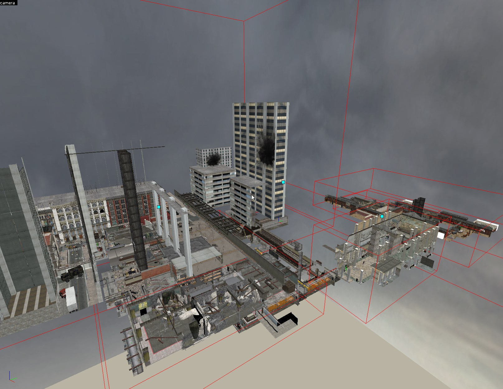
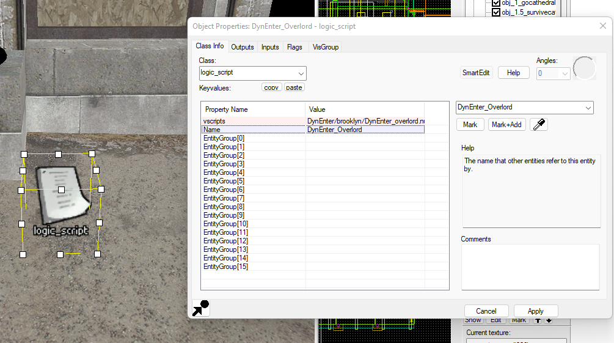
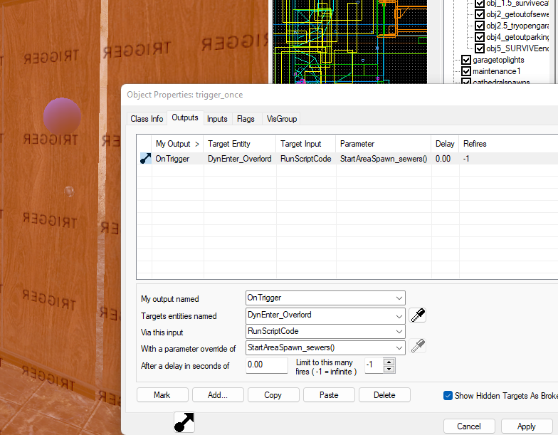
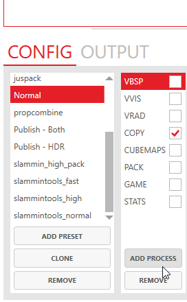
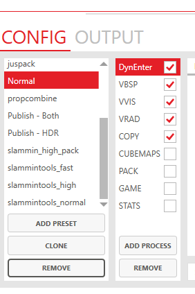

## WHAT is this?
    This script searches through cordons you define, and automatically creates VScript spawn functions for them. These function may then be used to dynamically spawn or despawn dynamic entities in your source map. 
    It also creates a copy of your vmf, removes the found entities, and feeds this precompiled vmf to vbsp for full compilation.

## WHY:                         

    - performance
    - shorter initial load time
    - fr3e eD1cTs!

    Source has low limits when it comes to dynamic entities count. If one can have dynamic entities unloaded, and load them at points on the map where they are needed you can circumvent these limits. Another benefit is potential performance increases, for clients as well as for servers and shorter initial loading times.

## HOWTO use:

### 1.  Install:
        This precompiler, DynEnter   - 
        [optional] CompilePalX           - Easy compile and precompiling
                https://github.com/ruarai/CompilePal/releases/tag/v027.30
        [optional] Plugin for CompilePal - Easy precompiling
                included in this repo
        Copy the DynEnter directory to your nmrih/bin directory
        Copy the parameters directory to your nmrih/bin directory

### 2.  Setup the VMF

    Make cordons around areas you want to have entities be dynamically loaded.
        It is not mandatory to cordon everything. Un-marked areas are simply skipped in the precompiler and will load at map start.
    Name these cordons something descriptive and give their name the prefix 'DynEnter_',   to mark them for the dynamic spawner.

    Place a script_logic somewhere in your map. Create a new keyvalue (disable smartedit, press add) with name 'vscripts' value 'DyntEnter/<mapname>/DynEnter_overlord.nut'
    mapname will be the second word/title in your map's filename:
        eg: nmo_newyork_v21 would be newyork

    In transitions betweens map areas, such as corridors or elevators, create a trigger. Have it output the following:
    OnTrigger script_logicname StartAreaSpawn_<areaname>()
    areaname will be the descriptive cordon name you have made earlier, without the prefix:
        eg: dynspawn_garage would be garage

### 3.  Run precompiler, and compile map

        Use the provided CompilePalX plug-in in the compile steps -before- vbsp. It 
        launches DynEnter precompiler which creates a new vmf with entities in areas removed. The entity data is stored into vscript scripts which may later be called ingame to load the entities. The modified vmf is then passed into vbsp and the compilation is continued.

    You may also manually precompile the map and then compile the processed VMF. It will be
        located in this script directory's vmfoutput folder.

    If there are problems in the precompiler please submit a bug report!

### 4.  Test your map ingame. 
        Trigger your defined triggers. If all goes well you will see 
        entities being loaded in. If nothing happens check if the paths in the trigger output are correct.

